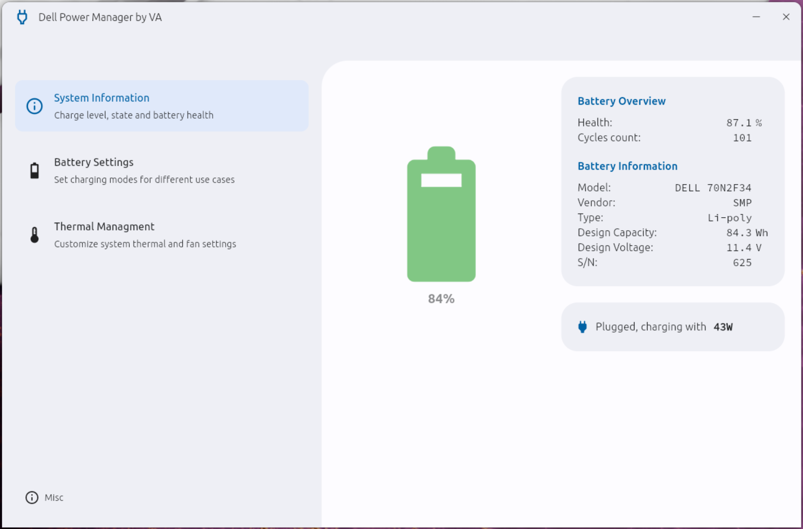

# Dell Power Manager
Cross-Platform Dell Power Manager re-implementation in Flutter. More screenshots in [Wiki](https://github.com/alexVinarskis/dell-powermanager/wiki).

## Why
Dell machines (XPS and Precision series laptops, potentially others) offer advanced in-bios configurable options, such as multiple thermal profiles, battery charging thresholds, etc. It may be very desirable to adjust these on the go, and there is no way to configure it from OS without Dell's proprietary tools (which are luckily provided). Settings can be changed via:
* BIOS directly, requires reboot
* [Dell Command | Configure](https://www.dell.com/support/kbdoc/en-us/000178000/dell-command-configure) CLI, available for both Windows and Linux, with impressive [list of capabilities](https://dl.dell.com/topicspdf/command-configure_reference-guide4_en-us.pdf).
* [Dell Power Manager](https://www.dell.com/support/contents/en-au/article/product-support/self-support-knowledgebase/software-and-downloads/dell-power-manager) GUI, available for Windows only. On top of that, it is ridiculously slow to start, and (subjectively) ugly.

This app is a modern, Flutter based GUI on top of Dell Command | Configure CLI, with main goal to replicate behavior of Dell Power Manager for Linux users, but also does run on Windows.

## Features
* Implements control via 'Dell Command | Configure CLI' (CCTK)
* Modern animated UI, supports Dark Mode
* Short startup time, much faster than Dell's Windows app
* Detects and handles unsupported modes on supported machines
* Detects non-dell machines, shows error message
* Support protected BIOS (System/Setup/Owner passwords), and secure key saving

For Debian/Ubuntu based Linux and Windows, app is slightly more productized:
* Integrated dependencies downloader and installer
* Packaged to `.deb`/`.msi`, with start menu shortcuts etc.
* Integrated OTA via Github API

Control features:
* Battery status overview (health etc.)
* Battery charging control (w/o advanced/daily timing mode for now)
* Thermal profiles control
* Detects OS's power mode

Planned TODOs:
* Advanced battery charging control/shceduling ([Feature Request](https://github.com/alexVinarskis/dell-powermanager/issues/24))

Potential future features to consider:
* Add monitoring service for auto switching thermal profiles based on CPU load
* Add monitoring service for auto switching thermal profiles based on power settings, eg. Battery level, plug/unplugged etc.

## Development status
Application is currently in __public beta__ stage.

* Dell's CCTK integrated (with automated installer for select OSs)
* Update checks implemented (with OTA ia Github API for select OSs)
* UI tested, build and packaging asserted by CI
* Tested on multiple platforms, see [Compatibility](#compatibility)
* Packaged to `.msi`, `.deb`, `.tar.xz`. Get latest stable build at [Releases](https://github.com/alexVinarskis/dell-powermanager/releases/latest), or latest development build at [CI artifacts](https://github.com/alexVinarskis/dell-powermanager/actions/workflows/build.yml?query=branch%3Amaster)

### Linux
* Run from source via `flutter run`, build via `flutter build linux --release`
* Package to `.deb`, `.tar.xz` via `./package.sh`

### Windows
* Run from source via `flutter run`, build via `flutter build windows --release`
* Package to `.msi` via `.\package.bat`

## Contributing

### Debugging

By default, all logging is supressed. Export `POWERMANAGER_DEBUG=true` before running app from CLI to get logs.
Eg.: `export POWERMANAGER_DEBUG=true && ./dell-powermanager > file.log`. When opening an issue, kindly save and attach the log.

### Translations
App supports multiple languages via Flutter's localization library. If you want to contribute:
* Check out [lib/l10n/*.arb](lib/l10n/app_en.arb) files.
* Create similar file for you language, translate the strings.
* Open PR with your changes.

## Compatibility
Tested on the following devices:
* Dell Precision 7560
    * [Fedora 41, 6.12.4](https://github.com/alexVinarskis/dell-powermanager/issues/47)
* Dell XPS 17 9700
    * [Tumbleweed OpenSUSE, 6.7.5](https://github.com/alexVinarskis/dell-powermanager/issues/31)
* Dell XPS 15 9560
    * [Arch Linux, 6.11.6-arch1-1](https://github.com/alexVinarskis/dell-powermanager/issues/46)
* Dell XPS 15 9530 (2023/Fiorano)
    * Ubuntu 23.04, 6.5.0-060500-generic
    * Ubuntu 23.10, 6.5.0-060500-generic
    * Windows 11 Pro 22H2, 22621.2428
* Dell XPS 15 9520
    * [Arch, 6.7.5](https://github.com/alexVinarskis/dell-powermanager/issues/31)
    * Ubuntu 22.04, 6.2.0
    * Windows 11 Home 22H2, 22621.2428
* Dell XPS 13 9310
    * Ubuntu 22.04.3, 6.2.0-26-generic
    * Windows 10 pro 22H2, 19045.3324
* Dell Vostro 5401
    * [Ubuntu 23.10](https://github.com/alexVinarskis/dell-powermanager/issues/23) 

If you experienced problems with any of the above mentioned devices, please open [**Bug Report**](https://github.com/alexVinarskis/dell-powermanager/issues/new?template=bug_report.md&title=[BUG]). If you have tested it on other devices, please report [**Tested device**](https://github.com/alexVinarskis/dell-powermanager/issues).

## Known issues
Please see [issues](https://github.com/alexVinarskis/dell-powermanager/issues).
## Credits
* Dell for providing 'Dell Command | Configure CLI'
* Google for creating Flutter :)

## Disclaimer
As per license, this software is provided as-is, without any warranty. It is not affiliated with Dell in any way. Use at your own risk. Me or any other contributors are not responsible for any damage caused by this software, including but not limited to data loss, hardware damage, data breaches etc. Where applicable, integrated solution for secure key saving is used, but it is not guaranteed to be secure in any way. Understand risk and implications before using it. No legal claims can be made against the author or contributors.

## License
This application is licensed under GPLv3. In short, this means you use/copy/modify/distribute it for free, but you must provide source code of your modifications, and keep the same license. You cannot sell it as proprietary software. See [LICENSE](LICENSE) for details.
