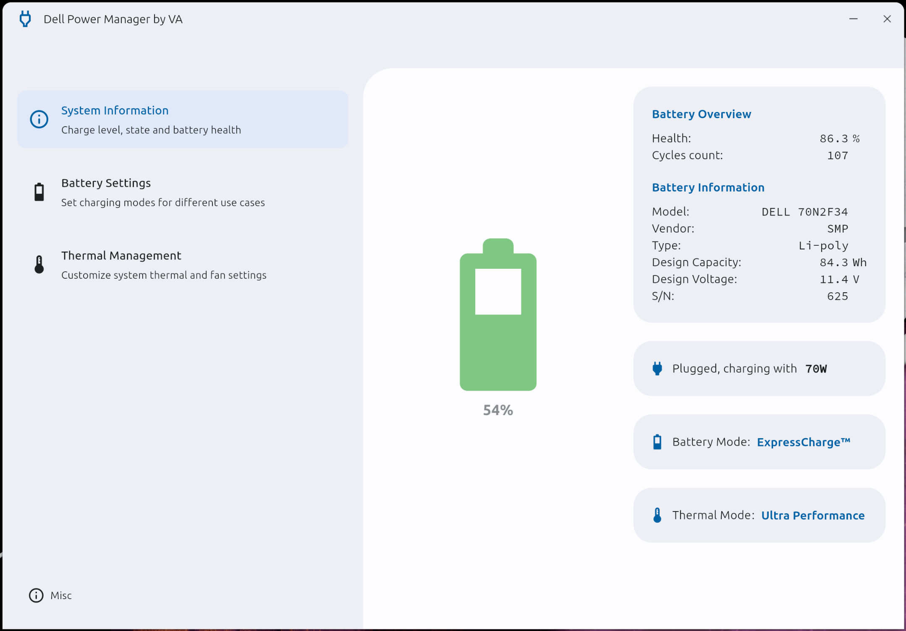

# Dell Power Manager
Cross-Platform Dell Power Manager re-implementation in Flutter. More screenshots in [Wiki](https://github.com/alexVinarskis/dell-powermanager/wiki).

## Why
Dell machines (XPS and Precision series laptops, potentially others) offer advanced in-bios configurable options, such as multiple thermal profiles, battery charging thresholds, etc. It may be very desirable to adjust these on the go, and there is no way to configure it from OS without Dell's proprietary tools (which are luckily provided). Settings can be changed via:
* BIOS directly, requires reboot
* [Dell Command | Configure](https://www.dell.com/support/kbdoc/en-us/000178000/dell-command-configure) CLI, available for both Windows and Linux, with impressive [list of capabilities](https://dl.dell.com/topicspdf/command-configure_reference-guide4_en-us.pdf).
* [Dell Power Manager](https://www.dell.com/support/contents/en-au/article/product-support/self-support-knowledgebase/software-and-downloads/dell-power-manager) GUI, available for Windows only. On top of that, it is ridiculously slow to start, and (subjectively) ugly.

This app is a modern, Flutter based GUI on top of Dell Command | Configure CLI, with main goal to replicate behavior of Dell Power Manager for Linux users. If it proves to be useful, I may add support for Windows as well.

## Features
* Implement control via 'Dell Command | Configure CLI', installed separately or via integrated installer
* Integrated dependencies downloader and installer
* Modern animated UI, supports Dark Mode
* Short startup time, unline Dell's app
* Packaged to .deb (Linux) .msi (Windows), with start menu shortcuts etc.
* Integrated OTA via Github API (Linux only for now)

Control features:
* Battery status overview (health etc.)
* Battery charging control (w/o advanced/daily timing mode for now)
* Thermal profiles control
* Detects OS's power mode

Planned TODOs:
* Detect non-dell machines, act accordingly
* Detect unsupported modes on supported machines, act accordingly

Potential future features to consider:
* Add monitoring service for auto switching thermal profiles based on CPU load
* Add monitoring service for auto switching thermal profiles based on power settings, eg. Battery level, plug/unplugged etc.

## Development status
Application is currently in __public beta__ stage.
### Linux
* UI tested, build asserted by CI
* Dell's CCTK integrated, as well as automated installer
* Tested on multiple platforms, see [Compatibility](#compatibility)
* Packaged to `.deb`, get latest stable build at [Releases](https://github.com/alexVinarskis/dell-powermanager/releases), or latest development build at [CI artifacts](https://github.com/alexVinarskis/dell-powermanager/actions/workflows/build.yml?query=branch%3Amaster)
* Run from source via `flutter run`, build via `flutter build linux --release`
* OTA integrated via Github API

### Windows
* UI tested, build asserted by CI
* Dell's CCTK integrated, as well as automated installer
* Tested on multiple platforms, see [Compatibility](#compatibility)
* Packaged to `.msi`, get latest stable build at [Releases](https://github.com/alexVinarskis/dell-powermanager/releases), or latest development build at [CI artifacts](https://github.com/alexVinarskis/dell-powermanager/actions/workflows/build.yml?query=branch%3Amaster)
* Run from source via `flutter run`, build via `flutter build windows --release`

## Compatibility
Tested on the following devices:
* Dell XPS 15 9530
    * Ubuntu 23.04, 6.5.0-060500-generic
    * Ubuntu 23.10, 6.5.0-060500-generic
    * Windows 11 Pro 22H2, 22621.2428
* Dell XPS 15 9520
    * Ubuntu 22.04, 6.2.0
* Dell XPS 13 9310
    * Ubuntu 22.04.3, 6.2.0-26-generic
    * Windows 10 pro 22H2, 19045.3324

If you experienced problems with any of the above mentioned devices, please open [**Bug Report**](https://github.com/alexVinarskis/dell-powermanager/issues/new?template=bug_report.md&title=[BUG]). If you have tested it on other devices, please report [**Tested device**](https://github.com/alexVinarskis/dell-powermanager/issues).

## Known issues
Please see [issues](https://github.com/alexVinarskis/dell-powermanager/issues).
## Credits
* Dell for providing 'Dell Command | Configure CLI'
* Google for creating Flutter :)

## License
This application is licensed under GPLv3. In short, this means you use/copy/modify/distribute it for free, but you must provide source code of your modifications, and keep the same license. You cannot sell it as proprietary software. See [LICENSE](LICENSE) for details.
